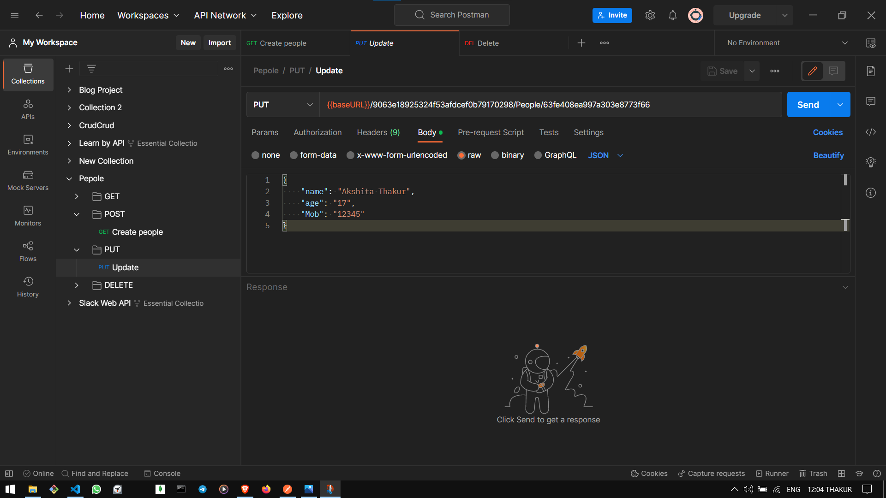
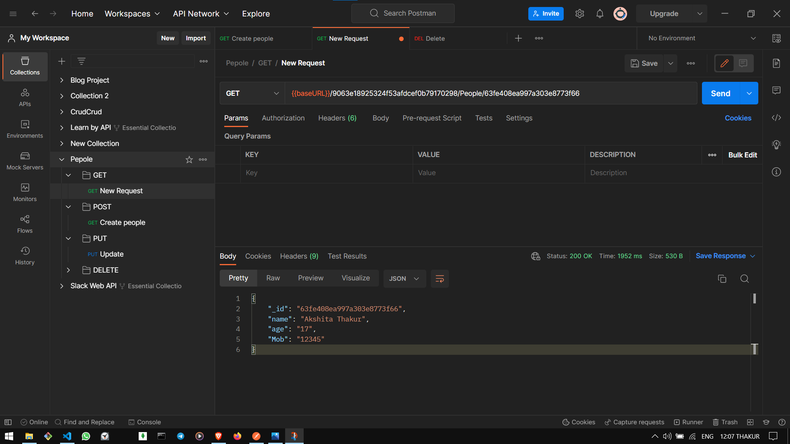

# Curd.Crud Data Server  Releated Picture

# first image is Create the Request

.png)

# Update the data 

# Get the data

# Show the data on the browser  

.png)

# show collection on the Curd.curd server

.png)

# Delete the data from the collection

.png)
